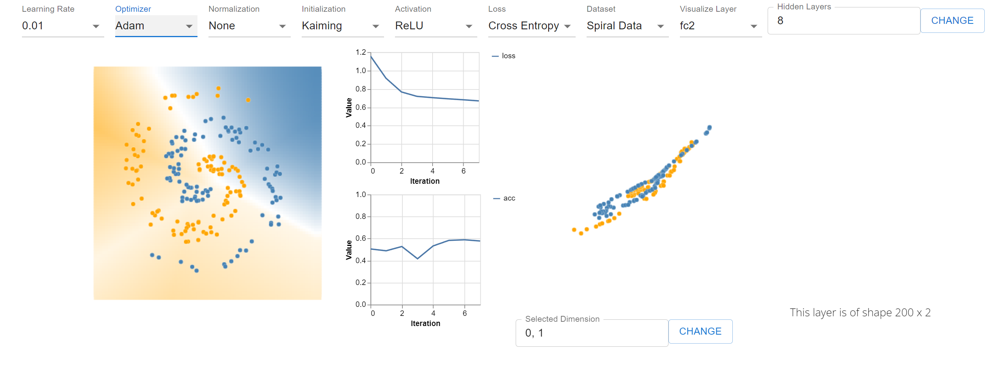
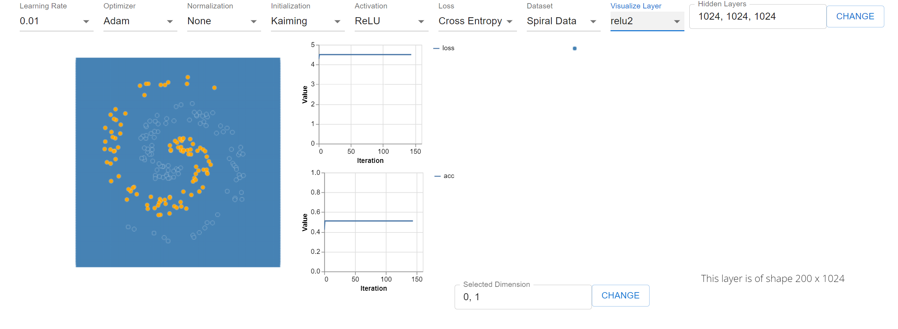
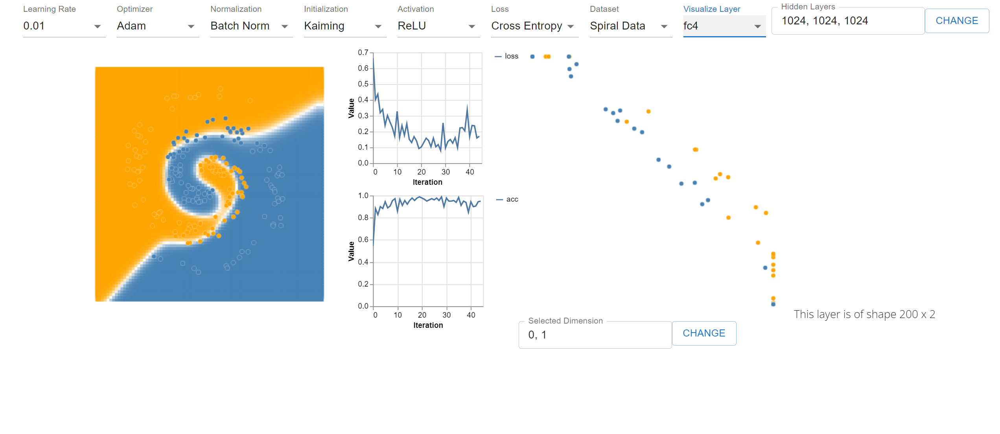
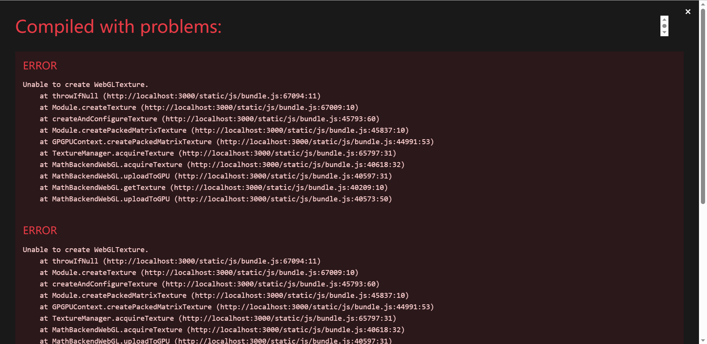

# Intuitive Classification: 技术报告
## 技术路线
本项目使用了`React`, `TensorFlow.js` 以及`D3.js`，基于`Node.js`，利用`React`组件搭建整体应用框架，利用`TensorFlow.js`实现模型搭建和推理，最后使用`D3.js`实现模型可视化。\
配合本项目中的`README.md`部署应用，建立相应的模块。
## 实现细节
### 项目构成
本项目构成如下：\
\---src\
|&emsp;   index.js\
|&emsp;   utilities.css\
|   
+---Component\
|&emsp;   |&emsp;   App.css\
|&emsp;   |&emsp;   App.js\
|&emsp;   |&emsp;   Control.js\
|&emsp;   |   
|&emsp;   \---modules\
|&emsp;&emsp;           ControlPanel.css\
|&emsp;&emsp;           ControlPanel.js\
|&emsp;&emsp;           Data.css\
|&emsp;&emsp;           Data.js\
|&emsp;&emsp;           NavBar.css\
|&emsp;&emsp;           NavBar.js\
|&emsp;&emsp;           Play.js\
|&emsp;&emsp;           Training.css\
|&emsp;&emsp;           Training.js\
|           
\---utils\
datasets.js\
model.js\
plot.js\
其中，在`Component`中实现了各种`React`组件，在`Training.js`中实现了模型推理以及可视化。在`utils`中实现了模型工具，可视化工具的搭建，并在组件中实现调用。
### 实现细节
在`Training.js`中利用`React`的`useRef`的*hook*实现`HTML`与`React`的交互。使用`useEffect`的*hook*, 每当内部`epochCounter`更新时，`Training`组件自动更新，当`Control`组件或`epochCounter`更新时，模型推理一次，并更新决策边界，损失更新与层输出。\
在`Control.js`中，定义如下组件：\
```
<LearningRateSelector learningRate={selectedValues.learningRate} onChange={handleLearningRateChange}/>
<OptimizerSelector optimizer={selectedValues.optimizer} onChange={handleOptimizerChange}/>
<NormalizationSelector normalization={selectedValues.normalization} onChange={handleNormalizationChange}/>
<InitializationSelector initialization={selectedValues.initialization} onChange={handleInitializationChange}/>
<ActivationSelector activation={selectedValues.activation} onChange={handleActivationChange}/>
<LossSelector loss={selectedValues.loss} onChange={handleLossChange} />
<DataSetSelector dataset={selectedValues.dataset} onChange={handleDatasetChange}/>
<VisLayerSelector onChange={handleVisLayerChange} model={model} visLayer={visLayer} />
<HiddenLayersInput onChange={handleHiddenLayersChange} />
```
这些参数设置了模型的初始参数，具体为：
学习率，优化器，标准化方法，权重初始方法，激活函数，损失函数，数据集选择以及隐藏层神经元个数设置。\
在操作层面`VisLayerSelector`组件可以设置神经网络层输出可视化的选择。\
其中，标准化方法实现了Batch Normalization以及Layer Normalization, 初始化方法包含：Kaiming Normal, LeCun Normal, Random Normal, One, Zero，其中One和Zero代表全零与全一。
优化器实现了Momentum, Nesterov Momentum, Adam, SGD以及RMSProp
## 使用实例
根据`README.md`中的指示，部署模型。
本项目的优势是可以实现自定义参数，用户可以自己定义隐藏层的神经元个数，并观测每层输出的二维可视化，通过选择不同神经元，用户可以观测到不同相关性。\
示例一：基本配置\

可以使用默认配置，选择不同优化器观察模型的损失，决策边界以及输出层。\
示例二：深度神经网络为何难以训练\

图中，我们设置了隐藏层数为3，每层含有1024个神经元的神经网络\
因为没有任何标准化技术的校正，在深层网络中，输出崩塌至常值，导致神经网络训练失败。
示例三：BN的作用\

在与示例二相同的设置下，BN使得神经网络迅速收敛，可以通过设置不同层数，观察BN层如何标准化和线性平移不同的输出。
## 不足
1. 在`Hidden Layers`组件和`Selected Dimension`组件中，没有实现输入输出错误提示，当用户输入无法接受的字符值时，应用本身会拒绝实现，但是应用不会给用户任何警告。
2. 在少数情况下，如当神经元设置个数大于10000，应用会爆出WebGL内存不足的错误，导致程序崩溃。

3. 随着神经元和隐藏层数增多，计算资源减少，应用会可预见地变慢，我认为大概2M左右的参数是流畅使用的上限。
技术报告会随着使用继续在本项目的[代码仓库](https://github.com/baichuanzhou/Intuitive-Classification)更新。